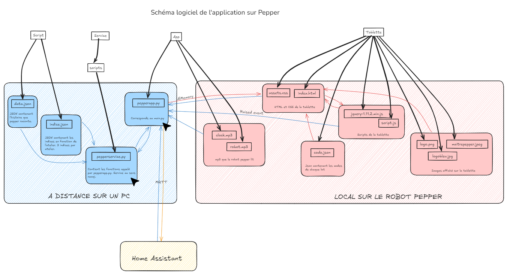

# 🔧 Pepper

## 📜 Description de l'atelier

Le but principal de ce projet est de permettre à Pepper d'interagir avec les utilisateurs à travers un escape game, tout en gérant les signaux en temps réel. Le projet inclut :

- Des scripts Python pour piloter Pepper.
- Une interface web permettant aux joueurs de suivre les étapes du jeu et de rentrer des codes secrets.
- La gestion des états et des signaux entre le robot et l'interface via ALMemory.
- Une fonctionnalité de donneur d'indices activée par un appui sur la tête de Pepper.

---

## 🛠️ Fonctionnalités principales

1. **Pilotage du robot Pepper** :
   - Programmation en Python 2.7 pour contrôler Pepper.
   - Interaction via la librairie **NAOqi**.
   - Utilisation des services comme `ALMemory`, `ALTextToSpeech`, et `ALMotion`.

2. **Interface web interactive** :
   - Interface web accessible depuis la tablette de Pepper, permettant de suivre l'avancement du jeu.
    - Navigation dynamique entre les différentes étapes et validation des codes secrets

3. **Gestion des signaux en temps réel** :
   - Utilisation de qimessaging.js pour transmettre des événements entre Pepper et l'interface web.
   - Synchronisation des états entre le robot et l'application web.

4. **Système de progression** :
   - Suivi des étapes du jeu (0%, 33%, 66%, 99%).
   - Validation des codes successifs et passage à l'étape suivante.

5. **Donneur d'indices**
    - Détéction d'un appui sur la tête
    - En fonction de l'étape du jeu, Pepper fournit un indice ou la solution complète.

---

## 🛠️ Architecture technique

### 📂 Structure globale du projet

```plaintext
.
├── Tablette/
│   ├── index.html              # Interface web principale
│   ├── script.js               # Gestion des signaux et interactions web
│   ├── assets.css              # Styles CSS pour l'interface
│   ├── code.json               # Fichier contenant les codes à entrer
│   ├── jquery-1.11.2.min.js    # Librairie jQuery utilisée
│   └── ...                     # Photos et assets pour l'interface
├── App/
│   ├── pepperapp.py            # Script Python principal pour contrôler Pepper
│   └── ...                     # Fichiers audio utilisés pour les dialogues de Pepper
├── Service/
│   ├── script/
│   │   ├── pepperservice.py    # Script pour gérer les services NAOqi de Pepper
│   │   └── ...                 # Autres scripts et configurations
│   └── ...
├── Script/
│   ├── data.json               # Histoire complète du jeu
│   └── indice.json             # Définition des indices en fonction des étapes
└── README.md                   # Documentation du projet

```

## 🖥️ Technologies utilisées

### Sur le robot Pepper
- **Python 2.7** : Nécessaire pour les scripts NAOqi.
- Librairies principales :
  - **NAOqi SDK** : Pour contrôler les mouvements, les interactions et la mémoire du robot.

### Côté interface web
- **HTML/CSS/JavaScript** : Construction de l'interface web.
- **jQuery** : Simplification des manipulations DOM.
- **qimessaging.js** : Gestion des événements avec le robot via WebSocket.

---

## 📡 MQTT : Communication entre le robot et les autres ateliers
Le protocole MQTT (Message Queuing Telemetry Transport) est utilisé pour assurer la communication en temps réel entre Pepper et le reste des ateliers (et le controle via Home Assistant). MQTT permet de transmettre des messages de manière légère et efficace, ce qui est crucial pour un projet interactif tel qu'un escape game. Le robot pepper attends un Start de la part de home assistant pour débuter l'escape game. Puis lorsqu'il reçoit un reset il recommence du début en attendant un start. Cette partie sera décrite côté Home Assistant.


## 🚀 Déploiement et utilisation

### 1. Pré-requis

- **Robot Pepper** :
  - Pepper doit être sous tension et connecté au même réseau que votre ordinateur.
  - NAOqi SDK doit être installé et configuré sur le robot

- **PC** : 
    - Python 2.7 doit être installé sur votre machine locale pour exécuter les scripts

- **Modifier les .json**:
    - Si vous avez besoin de personnaliser l'histoire, les indices ou les codes finaux, vous pouvez modifier les fichiers data.json, indice.json et code.json.

- **Broker MQTT**
    - Vous devez disposer d'un serveur MQTT pour la communication entre le robot et l'interface web. Un exemple de broker populaire est Mosquitto

### 2. Déploiement

#### Côté Web
1. Copiez les fichiers du dossier Tablette/ sur la tablette de Pepper (ou sur un serveur accessible depuis celle-ci).

#### Côté Robot
1. Lancez les scripts pepperservice.py et pepperapp.py sur le robot.
2. Utilisez les commandes suivantes pour démarrer les services et l'application principale :
```bash
$ python2.7 pepperservice.py --qi-url "VOTRE_URL_DE_PEPPER"
$ python2.7 pepperapp.py
```

## 📂 Diagrammes
**Schéma logiciel :**  

 

**Schéma logiciel :**  


## 🖥️ Captures d'écran

### Robot 


### Mise en route 
[Vidéo de mise en route du robot PEPPER](https://youtu.be/T9yHQd0aRbA)


## 💡 Aide et Support
Pour toute question ou problème, vous pouvez ouvrir une issue sur le dépôt GitLab ou me contacter par email : elea.machillot@cpe.fr
