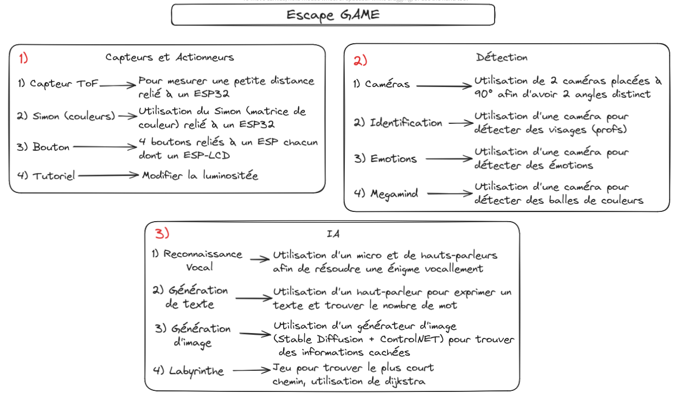

# Projet escape game : MISSION TRANSFERT

Ce projet a été réalisé par Elea Machillot, Julien Perbet, David Jeannin, et Anaïs Delcamp.

## Description

Ce projet vise à créer un escape game autour de la robotique. Il est structuré en plusieurs dossiers. Chaque dossier correspond au lot d'epreuves de l'escape game.

## Schémas

### Synthese

### Sprint 1 :

## Structure du projet

Le projet est divisé en plusieurs parties, chacune représentant un lot d'épreuves. Pour plus de détails, veuillez consulter les README spécifiques à chaque dossier :

- [Lot d'épreuves capteurs](./Capteurs/readme.md) : Implémentation de capteurs pour comme des ToF ou un Simon.
- [Lot d'épreuves de détection](./Detection/readme.md) : Mise en œuvre des systèmes de détection d'émotions ou de visage.
- [Lot d'épreuves IA](./IA/readme.md) : Développement des algorithmes d'intelligence artificielle utilisés pour interagir avec les joueurs avec des énigmes.
- [Robot Pepper](./Pepper/readme.md) : Contrôle et gestion du robot Pepper utilisé comme guide et assistant dans le jeu.
- [Unité central](<./Unité central/readme.md>) : Contrôle de l'escape game et des triggers

## Installation

Pour installer et exécuter ce projet, veuillez suivre les instructions fournies dans les README des dossiers spécifiques.

## Vidéos de présentation global

## Contact

Pour toute question ou suggestion, n'hésitez pas à nous contacter par email :
- elea.machillot@cpe.fr
- julien.perbet@cpe.fr
- david.jeannin@cpe.fr
- anais.delcamp@cpe.fr

Merci d'avoir consulté notre projet !
